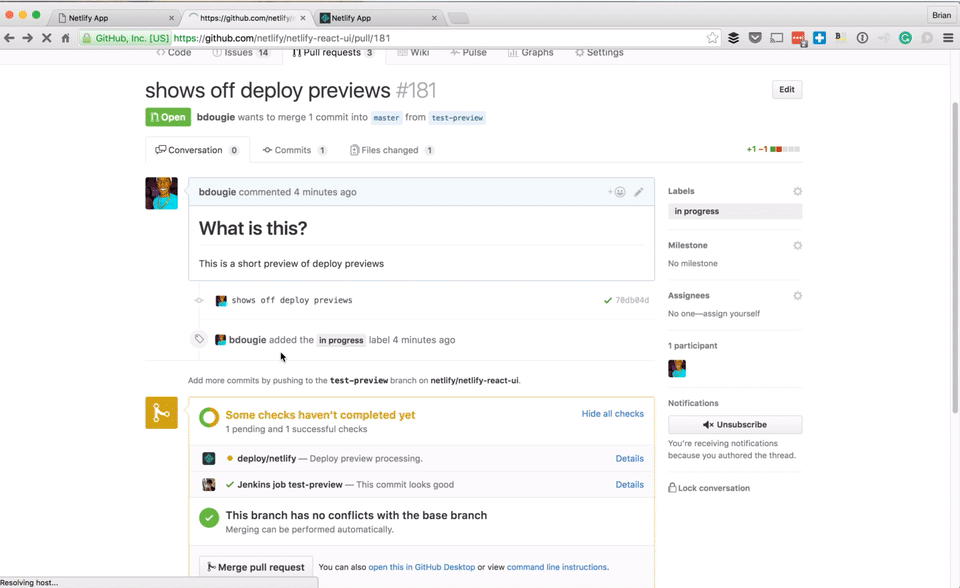

# WONTFIX Cabal Website

This repo holds the source code for the WONTFIX Cabal website.

The site uses [`hugo`](https://gohugo.io/) and is hosted on [netlify](https://www.netlify.com/). Pull requests will be tested on netlify as well.

As always if you would like to change something, submit a pull request.

## Contributing

If you'd like to contribute code to the WONTFIX Cabal website, here's how to get
started:

### Setup
1. Install [Hugo](http://gohugo.io)
1. Fork this repo

### View site locally
1. To watch for changes and rebuild on the fly, open a new terminal, cd to your
fork of the repo, and enter this command:
`hugo server -w --baseUrl="http://localhost:1313"`
1. OS X has low ulimits, so you may see this message:
```
hugo server -w --baseUrl="http://localhost:1313"
[...]
Error: listen tcp 127.0.0.1:1313: socket: too many open files
```

You can correct it with this:
```
 $  hugo check ulimit
 $  sudo sysctl -w kern.maxfiles=65536
 $  sudo sysctl -w kern.maxfilesperproc=65536
 $  ulimit -n 65536 65536
```
Then in a new window:
```
 $  hugo server -w --baseUrl="http://localhost:1313"
```

A more permanent fix is to add the following to `/etc/sysctl.conf` (run
`touch /etc/sysctl.conf` first if the file doesn't exist; it likely does not):

```
kern.maxfiles=20480
kern.maxfilesperproc=24576
```
...and reboot!

### Contribute changes
1. Code changes that affect the overall site will be reviewed only if they are
in a separate pull request from any event-specific content. tl;dr: don't add
"giant template change" in the same PR as "here are some more sponsors". If it
affects anything other than the event, it should be in its own PR.
1. We use [github issues](https://github.com/maintainerati/wontfix-cabal-site/issues)
to track work, so feel free to create new ones if you like (or read/comment on
existing ones).
1. Before you commit any changes, create a new branch, i.e., `git checkout -b fix-that-thing`.
1. Make your changes, test them locally, then push that branch up to origin on
your fork (`git push origin BRANCHNAME`).
1. Submit a pull request from the branch you just pushed.
1. When a commit is merged to master on github (ideally via a PR reviewed by at
least one other person), netlify will automatically build the site and publish
it to [https://maintainerati.org](https://maintainerati.org).
**NOTE:** You will even be able to view the changes to the site **IN** your pull request
via a [deploy preview](https://www.netlify.com/blog/2016/07/20/introducing-deploy-previews).


